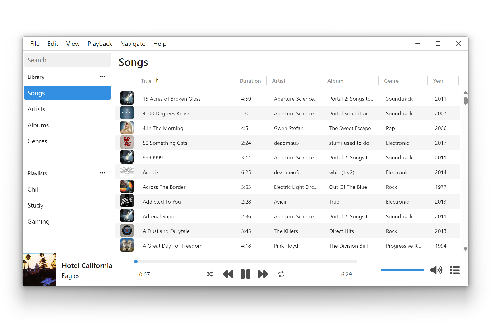

# Aria

A modern music player for the desktop and browser

Aria is a cross-platform music player featuring:

- **Configurable views** so you can group tracks by album, artist, and more
- **Playlists and folders** to keep things organized
- **Queue management** with persistence across playlists
- **Custom themes** and support for light/dark mode
- **Plugins** for connecting to external streaming services

Aria is currently in development, so bug reports and suggestions are welcome. Check the [Issues](https://github.com/aria-player/aria/issues) page to see if yours has already been reported, and if not feel free to open a new issue.

## Installation

To install Aria, download and run the latest release for your platform:

[Windows (.exe)](https://github.com/aria-player/aria/releases/latest/download/aria_x64-setup.exe) | [macOS (.dmg)](https://github.com/aria-player/aria/releases/latest/download/aria_universal.dmg) | [Linux (.AppImage)](https://github.com/aria-player/aria/releases/latest/download/aria_amd64.AppImage)

Additional installer formats are available on the [Releases](https://github.com/aria-player/aria/releases/) page.

You can also use Aria [online](https://aria-player.github.io/aria/). The web version contains most of the desktop functionality, but requires that you re-select your music library folder at the start of each session.

## Roadmap

- [x] Project setup
- [x] Player controls
- [x] Initial plugin system
- [x] Library management/views
- [x] Shuffle/repeat
- [x] Playlists
- [x] Queue
- [x] Library search
- [x] Theme system
- [x] Initial streaming plugins
- [x] Plugin development documentation
- [x] Search sources for songs, artists, and albums
- [ ] Playlist import, export, and sync
- [ ] Theme asset support (embedding images/fonts)
- [ ] In-app plugin/theme browser
- [ ] Metadata editing
- [ ] Lyrics support
- [ ] Equalizer
- [ ] Improved plugin system (currently, plugins can only include browser JavaScript)

Currently the most significant challenge in this project is the plugin system. The goal is to enable integration with music streaming services, cloud storage providers, and services like Last.fm. However, the current implementation might not be very scalable. Any advice, suggestions, or contributions towards this goal would be greatly appreciated.

## Building and running

Aria uses [Tauri](https://v1.tauri.app/) to provide a cross-platform desktop wrapper for a web app. The web app uses a combination of [TypeScript](https://www.typescriptlang.org/), [React](https://react.dev/), and [Redux](https://redux.js.org/), with [Vite](https://vite.dev/) and [Bun](https://bun.sh/) for build tooling.

To build the web app, you will need to:

1. Install [Node.js](https://nodejs.org/) (any version newer than v18.0.0).
2. Clone or download this repository.
3. Install [Bun](https://bun.sh/).
4. Navigate to the downloaded folder and run `bun install`.
5. Run `bun dev` to run the web app in development mode or `bun run build` to build the web app.

To build the Tauri desktop app, you will also need to install the [prerequisites](https://v1.tauri.app/v1/guides/getting-started/prerequisites) listed on the Tauri website. You will then be able to use `bun tauri dev` to run the desktop app in development mode or `bun tauri build` to build and package the app into an executable.
