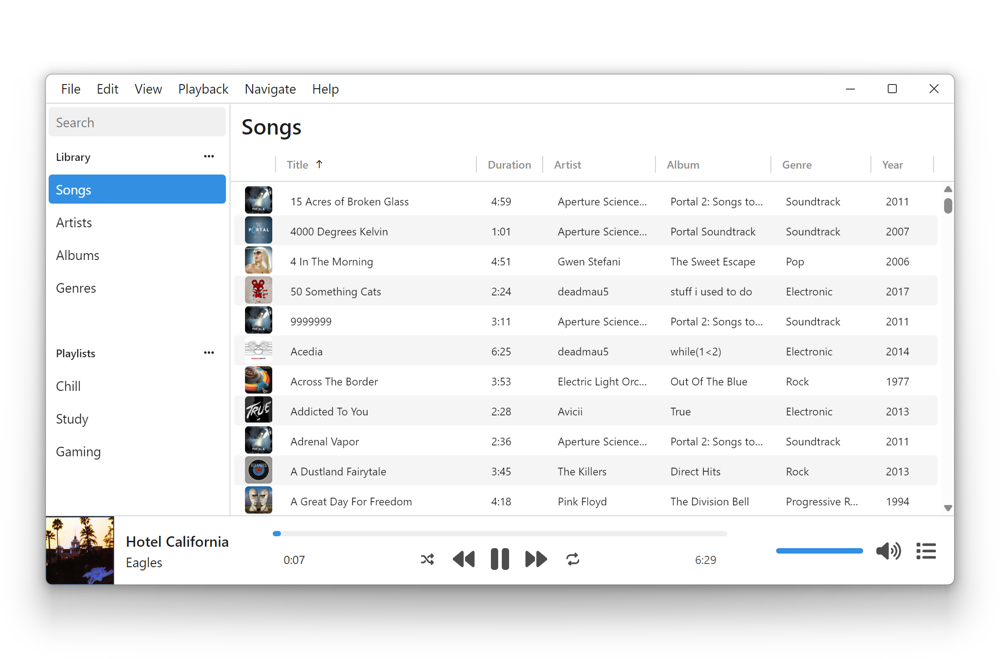

# Aria (alpha version)

A modern music player for the desktop and browser

Aria is a cross-platform music player featuring:

- **Configurable views** so you can group tracks by album, artist, and more
- **Playlists and folders** to keep things organized
- **Queue management** with persistence across playlists
- **Custom themes** and support for light/dark mode
- **Plugins** for connecting to external services

Aria is currently in an early 'alpha' state, so there are several limitations:

- The desktop app is currently untested on macOS
- The web app does not have a way of adding local music on Firefox/Safari
- Plug-ins/themes must be installed manually
- You must provide your own developer credentials to log in with Spotify
- Bugs and general instability are expected

## Installation

To install Aria, download and run the latest release for your platform:

[Windows (.exe)](https://github.com/aria-player/aria/releases/latest/download/aria_x64-setup.exe) | [macOS (.dmg)](https://github.com/aria-player/aria/releases/latest/download/aria_universal.dmg) | [Linux (.AppImage)](https://github.com/aria-player/aria/releases/latest/download/aria_amd64.AppImage)

Additional formats (including `.rpm`, `.deb`, and `.msi`) are available on the [Releases](https://github.com/aria-player/aria/releases/) page.

You can also try out Aria [online](https://aria-player.github.io/aria/). The web version contains most of the desktop functionality, but requires that you re-select your music library folder at the start of each session.

## Building and running

Aria uses [Tauri](https://v1.tauri.app/) to provide a cross-platform desktop wrapper for a web app. The web app uses a combination of [TypeScript](https://www.typescriptlang.org/), [React](https://react.dev/), and [Redux](https://redux.js.org/), with [Vite](https://vite.dev/) for build tooling.

To build the web app, you will need to:

1. Install [Node.js](https://nodejs.org/) (any version newer than v18.0.0).
2. Clone or download this repository.
3. Navigate to the downloaded folder and run `pnpm install`.
4. Accept the prompt to install a specific version of the [pnpm](https://pnpm.io/) package manager. If no prompt appears, you can install pnpm [manually](https://pnpm.io/installation).
5. Run `pnpm dev` to run the web app in development mode or `pnpm build` to build the web app.

To build the Tauri desktop app, you will also need to install the [prerequisites](https://v1.tauri.app/v1/guides/getting-started/prerequisites) listed on the Tauri website. You will then be able to use `pnpm tauri dev` to run the desktop app in development mode or `pnpm tauri build` to build and package the app into an executable.

## Roadmap

- [x] Project setup
- [x] Player controls
- [x] Initial plugin system
- [x] Library management/views
- [x] Shuffle/repeat
- [x] Playlists
- [x] Queue
- [x] Library search
- [x] Theme system
- [x] Initial streaming plugins
- [x] Plugin development documentation
- [ ] Playlist import/export
- [ ] Improved search (search for artists/albums)
- [ ] Improved plugin system (currently, plugins can only include browser JavaScript)
- [ ] Theme asset support (embedding images/fonts)
- [ ] In-app plugin/theme browser
- [ ] Metadata editing
- [ ] Lyrics support
- [ ] Equalizer

Currently the most significant challenge in this project is the plugin system. The goal is to enable integration with music streaming services, cloud storage providers, and services like Last.fm. However, the current implementation might not be very scalable. Any advice, suggestions, or contributions towards this goal would be greatly appreciated.
